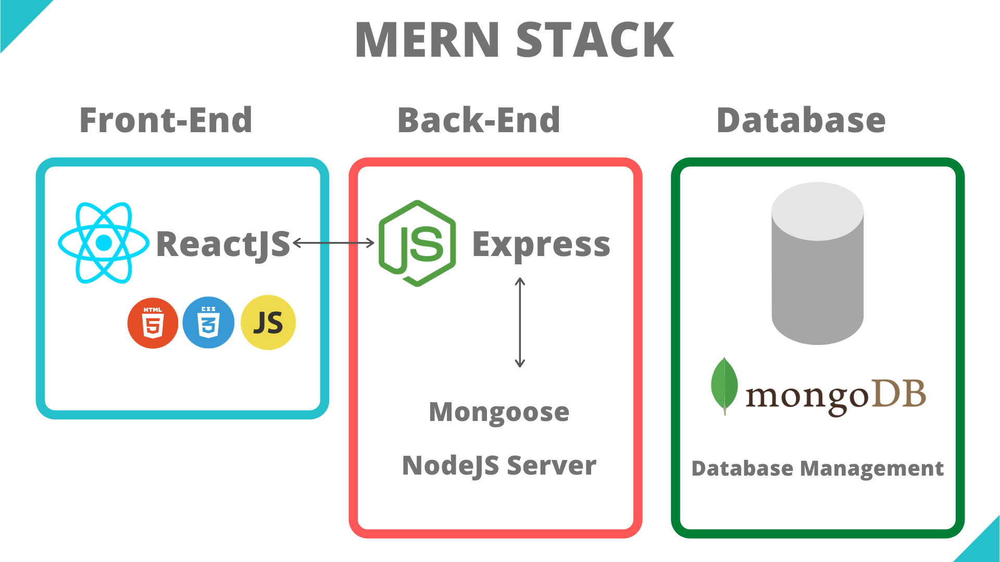

# MERN-STEP-BY-STEP

## Summary

Step-by-step guide on how to build a simple MERN stack application. This is basically my notes plus an attempt to explain it further to my future myself.

##### What we are going to do?

We will be building a MERN full-stack Todo app with `React CDN` for simplicity, however, you could use this backend as a model to any front-end interface, as our back-end is 100% autonomous.

We will be passing data with props, creating state, and connecting our Front-End to Back-End by fetching the data from our Back-End. After you style the application (I have provided three mockups/wireframe with color pallets), we are going to deploy our application with Heroku, so the world can see what we have accomplished.

`This is meant for beginners as an exercise or learning project.`

#### Demo: https://artemis-taste.netlify.app/

## Let's start

#### First, what MERN stack stands for?

MERN is a full-stack web development framework, composed of four technologies MongoDB, ExpressJS, ReactJS, NodeJS

`MongoDB`: A document-oriented, No-SQL database used to store your app data.

`NodeJS`: It is a JavaScript runtime environment. It provides you with the ability to run JavaScript in a machine rather than in a browser.

`ExpressJS`: A framework layered on top of NodeJS, used to build the backend of a site using NodeJS functions and structures. Since NodeJS was not developed to make websites but rather run JavaScript on a machine, ExpressJS was developed.

`ReactJS`: It is a library created by Facebook. It is used to build UI components that create the user interface of the single page web application.

#### Why MERN stack?

Mainly because this stack is completed composed utilizing the JavaScript language, most code you are writing from back to front is javaScript.

